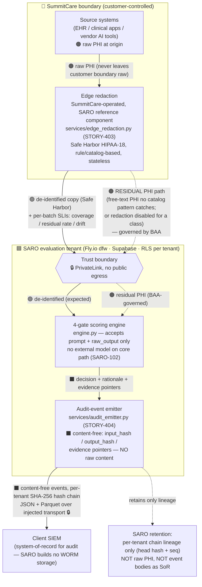
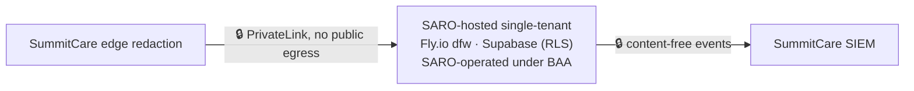
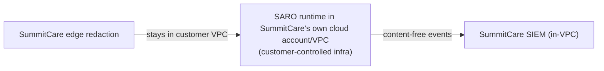

# STORY-BAA-01 — Data-Flow & Residency Diagram (for Privacy Office sign-off)

**Epic:** 15 — Trust & Compliance Enablement · **Workstream:** BAA
**Status:** DRAFT — awaiting Privacy Office review (see §5 approval field)
**Depends on:** the architecture-decision summary (`docs/ARCHITECTURE.md`, PT-012 stack of record)
**Owner (artifact):** Jordan Lee (Backend/Infra) · **Reviewer:** Venky (Lead)
**Approver (human gate):** SummitCare Privacy Office

> **Purpose.** SummitCare's Privacy Office must approve this data-flow diagram **before any PHI
> moves**. This is the artifact that unblocks the BAA scope conversation (STORY-BAA-02).
>
> **Not legal or privacy advice.** This is an engineering description of where data goes, drafted
> for the Privacy Office and counsel to review. It does not itself constitute Safe Harbor
> de-identification certification or a BAA scope determination.

---

## 1. Scope of this artifact

**In scope:** a diagram-as-code (Mermaid) + narrative showing exactly where data goes, per path,
with the trust boundary and each path labeled **de-identified (Safe Harbor)** or **residual PHI
(under BAA)**.

**Out of scope:** the deployment build itself; the BAA signature (STORY-BAA-02, human gate);
SummitCare's internal DLP; Expert Determination methodology.

**Honesty note (read before trusting "de-identified").** SARO's edge-redaction reference component
(`services/edge_redaction.py`, STORY-403) is deterministic and **rule/catalog-based**. Its coverage
and residual-identifier SLIs are measured **only against catalog-expressible patterns** — free-text
PHI that no catalog pattern can express (e.g. a member name in prose) can survive and is invisible
to the residual re-scan. SARO therefore **"mostly never holds raw PHI" — not "never."** That is
precisely why a residual-PHI path is drawn below and why the BAA is still required. No path in this
diagram is claimed PHI-free on the strength of redaction alone.

---

## 2. Data-flow diagram (production / BYOC variant)

Legend: 🔒 = PrivateLink / no public egress · 🟢 = de-identified (Safe Harbor) · 🟠 = residual PHI (under BAA) · ⬛ = content-free (hashes + pointers only)

---

## 3. Per-path narrative (AC-1, AC-2)

Each numbered path corresponds to an arrow above. "Boundary" = the SARO trust boundary (🔒).

| # | Path | Data classification | Where the boundary sits | Backing control |
|---|---|---|---|---|
| 1 | Source systems → Edge redaction | 🟠 **Raw PHI** | **Inside SummitCare** — raw PHI never crosses to SARO in raw form | SummitCare-operated; SARO ships reference component `services/edge_redaction.py` |
| 2 | Edge redaction → boundary (primary) | 🟢 **De-identified (Safe Harbor, HIPAA-18)** | Crosses boundary already redacted | `edge_redaction.py` HIPAA-18 catalog + per-batch coverage/residual/drift SLIs |
| 3 | Edge redaction → boundary (**residual**) | 🟠 **Residual PHI (under BAA)** | Crosses boundary; **BAA governs** because free-text/unclassified PHI can survive rule-based redaction | Measured, not assumed — residual-identifier SLI; honesty note §1 |
| 4 | Boundary → SARO evaluation | 🟢 expected / 🟠 residual | Inside SARO tenant (Fly.io `dfw`, Supabase RLS per tenant) | `engine.py` 4-gate scoring; accepts only `prompt` + `raw_output` |
| 5 | Evaluation → Audit emitter | ⬛ **Content-free** (hashes + pointers, no raw content) | Inside SARO tenant | `services/audit_emitter.py` schema forbids raw input/output |
| 6 | Audit emitter → Client SIEM | ⬛ **Content-free** events, per-tenant SHA-256 hash chain | Egress to customer SIEM over injected transport (🔒 PrivateLink in pilot) | `audit_emitter.py` JSON+Parquet export; client SIEM is system-of-record |
| 7 | SARO retention | ⬛ **Lineage only** (per-tenant head hash + sequence) | Inside SARO tenant | `audit_emitter.py` AC-4: no durable event storage as SoR, no raw PHI retained |

**Key boundary facts for the Privacy Office:**
- **Raw PHI (path 1) never leaves the SummitCare boundary in raw form.** Redaction happens at the
  customer edge; SARO provides the reference component but SummitCare operates it.
- **Two paths cross the boundary carrying data (2 and 3).** Path 2 is de-identified under Safe
  Harbor; **path 3 is residual PHI and is the reason a BAA is required.** Its volume is *measured*
  by the residual-identifier SLI, not assumed to be zero.
- **The audit path (5, 6) is content-free by construction** — events carry `input_hash`,
  `output_hash`, and evidence pointers, never raw input/output (pinned by a schema test in
  `tests/test_story404_audit_emitter.py`).
- **SARO retains no raw PHI and is not the system-of-record for audit events** — the client SIEM is.

---

## 4. Topology variants (AC-3)

The two deployment topologies differ in where the SARO evaluation tenant runs and who controls it.
Both keep raw PHI inside the SummitCare boundary and both keep the audit path content-free.

### Variant A — **Pilot: PrivateLink-hosted tenant** (SARO-operated, single-tenant)

- **Who runs SARO:** SARO, in a dedicated single-tenant deployment on the PT-012 stack (Fly.io
  `dfw` + Supabase, RLS per tenant).
- **Connectivity:** 🔒 PrivateLink / no public egress between SummitCare and the SARO tenant.
- **BAA posture:** SARO is a Business Associate; residual-PHI path (3) and any transient
  processing are **squarely in BAA scope**. This is the binding topology for the pilot.
- **Data residency:** primary region `dfw` (US). EU-region option noted for counsel if in-scope.

### Variant B — **Production: BYOC (Bring-Your-Own-Cloud)**

- **Who runs SARO:** SummitCare, inside its **own cloud account/VPC**; SARO ships the runtime.
- **BAA posture:** narrower — with the runtime in the customer's own boundary, SARO-as-BA exposure
  shrinks; the BAA still covers the reference components and any support access. Counsel confirms
  the exact split (see STORY-BAA-02 §2, narrowed-scope note).
- **Data residency:** determined by SummitCare's own cloud region selection.

> **Both variants are drawn as two variants, not merged.** The pilot (A) is the near-term binding
> topology; production (B) is the target and materially changes BAA scope. STORY-BAA-02 tracks the
> scope conversation for each.

---

## 5. Privacy Office approval (AC-4 — **[HUMAN] gate**)

> This story stays **OPEN** until a human in SummitCare's Privacy Office records approval below.
> Claude Code cannot set this field. Do not begin PHI flow on the strength of this draft alone.

| Field | Value |
|---|---|
| **Diagram renders** | ✅ (Mermaid — verify in a renderer; see §6) |
| **Every data path labeled de-identified-or-BAA** | ✅ (paths 1–7, §3) |
| **Pilot vs production drawn as two variants** | ✅ (§4 A and B) |
| **Approval status** | ⬜ **PENDING — not approved** |
| **Approved by (name, role)** | _____________________ (Privacy Office) |
| **Approval date** | _____________________ |
| **Conditions / scope notes from Privacy Office** | _____________________ |

---

## 6. Definition of done (tests)

- [x] **Diagram renders** — Mermaid `flowchart` blocks are syntactically valid (§2, §4).
- [x] **Every data path is labeled de-identified-or-BAA** — §3 table, paths 1–7, plus the
      content-free/lineage classifications for the audit and retention paths.
- [x] **Pilot vs production marked as two variants** — §4 A (PrivateLink) and B (BYOC).
- [ ] **Approval status field present and set by a human** — field present (§5); **value is set by
      the Privacy Office, not by Claude Code** → remains ⬜ until the human gate completes.

---

## CHANGES MADE
- Added the data-flow & residency diagram (Mermaid) with source → edge redaction → trust boundary →
  SARO evaluation → content-free audit events → client SIEM, with PrivateLink/no-public-egress marked.
- Wrote the per-path narrative classifying each path de-identified (Safe Harbor) vs residual PHI (BAA),
  anchored to the real controls (`edge_redaction.py`, `audit_emitter.py`, `engine.py`, ARCHITECTURE.md).
- Drew pilot (PrivateLink-hosted tenant) and production (BYOC) as two explicit variants.
- Added the Privacy Office approval field (human gate) and a DoD checklist.

## THINGS I DIDN'T TOUCH
- The deployment build itself (out of scope).
- Any runtime code — this is a documentation artifact only.
- The BAA signature and scope negotiation (STORY-BAA-02).
- SummitCare's DLP / Expert Determination methodology.

## POTENTIAL CONCERNS
- **Rule-based redaction is not total de-identification.** The residual-PHI path (3) is real and
  measured, not zero. The Privacy Office should decide whether the residual SLI threshold is
  acceptable or whether Expert Determination (a named, unimplemented hook in `edge_redaction.py`) is
  required before pilot PHI flow.
- **Data residency** shown as `dfw` (US) for the pilot; confirm whether SummitCare requires an EU or
  other region — that changes Supabase/Fly region config, not the flow shape.
- **BYOC support access** — even with the runtime in the customer VPC, any SARO support/debug access
  path must be enumerated for counsel; not fully drawn here pending the production build.
