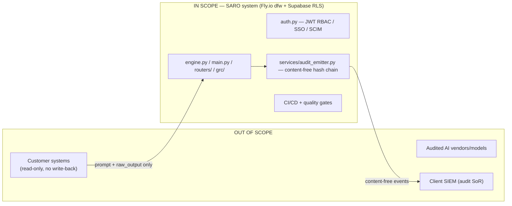

# STORY-SOC-01 — SOC 2 Type II Scope Definition + Observation-Window Kickoff

**Epic:** 15 — Trust & Compliance Enablement · **Workstream:** SOC 2 Type II
**Status:** DRAFT — scope proposed; **observation-window start is a [HUMAN] gate (unset)**
**Depends on:** none — starts immediately (the observation clock is the long pole)
**Owner (artifact):** Venky (Lead) · **Reviewer:** Jordan Lee (Backend/Infra)
**Human gate:** select + engage audit firm; set observation-window start date ("clock start")

> **Purpose.** The observation period can't start until scope and the audit engagement are set.
> This story defines scope/boundary/TSC and the auditor-engagement checklist so the clock can start.
>
> **Posture.** SARO holds **no SOC 2 report**. This is readiness scoping, "in progress / roadmap."
> Builds on and supersedes the planning in `docs/soc2-readiness-roadmap-v1.0.md` where they differ
> (that roadmap predates the PT-012 Fly.io stack freeze and still references Railway).

---

## 1. Scope of this artifact

**In scope:** Trust Service Criteria (TSC) selection with rationale; system description / boundary
(in-scope vs out); auditor-engagement checklist (readiness vs Type II, window-length options,
evidence expectations).

**Out of scope:** performing the audit; selecting the firm (procurement, human gate); building
controls (SOC-02 discovers them; gaps become follow-on stories).

---

## 2. Trust Service Criteria selection (AC-1)

**Security (Common Criteria) is the required baseline for every SOC 2.** For each optional category
below, the recommendation and the tradeoff are stated for a **healthcare PHI-governance product**.

| TSC | Recommendation | Rationale / tradeoff for a healthcare PHI-governance product |
|---|---|---|
| **Security (CC)** | **Include — mandatory** | Baseline for all SOC 2. Covers access control, change management, monitoring, incident response, vuln management. Non-optional. |
| **Confidentiality (C)** | **Include (recommended)** | SARO's core value is handling sensitive audit data under a confidentiality obligation; buyers in healthcare expect it. Tradeoff: adds controls for confidential-data identification, retention, and disposal — but SARO already has strong anchors (content-free audit events, PII redaction, no raw-PHI retention), so marginal cost is low. |
| **Availability (A)** | **Include (recommended)** | SARO is a runtime evaluation service; buyers will ask for uptime commitments. Tradeoff: requires **formal SLA/uptime commitments and DR testing** — currently gaps (see `docs/soc2-readiness-roadmap-v1.0.md` G-05, G-09). Including A forces those to be closed, which is desirable but adds observation-period work. |
| **Processing Integrity (PI)** | **Defer to Phase 2 (do not include in first Type II)** | Tempting because SARO's product *is* scoring integrity — but PI in SOC 2 is about complete/accurate/timely **system processing**, and committing to it invites scrutiny of scoring-determinism claims that are better evidenced by SARO's own engine tests than by a SOC 2 control set on day one. Tradeoff: excluding it is honest and keeps the first report achievable; revisit once determinism/quality-ratchet evidence is mature. |
| **Privacy (P)** | **Defer to Phase 2 (do not include in first Type II)** | Privacy (P) covers notice/choice/consent over **PII SARO collects about individuals** — largely SummitCare's obligation as data controller, and better served by the **BAA + Safe Harbor de-identification** posture than by SOC 2 Privacy. Tradeoff: deferring avoids overlapping/ambiguous commitments with the BAA; Confidentiality (C) already covers the data-protection story auditors and buyers care about here. |

**Recommended first-report scope: `Security + Confidentiality + Availability`.** Defer Processing
Integrity and Privacy to a Phase-2 report. This matches the roadmap's intent
(`docs/soc2-readiness-roadmap-v1.0.md` §1) and is the scope SOC-02 maps against.

> **[HUMAN] confirm:** Venky + audit firm ratify the TSC set before the window opens. Adding A commits
> SARO to SLA/DR evidence during observation — confirm that is acceptable, or drop A to Phase 2.

---

## 3. System description / boundary (AC-2)

### In scope (the "system" under audit)

| Component | What it is | Where it lives |
|---|---|---|
| **SARO runtime / scoring engine** | 4-gate risk scoring; accepts only `prompt` + `raw_output` | `engine.py`, `main.py`, `routers/` |
| **Governance runtime** | GRC gate, checks, provenance, sign-off, policy layer | `grc/` |
| **Audit pipeline** | Content-free event emitter + per-tenant SHA-256 hash chain + SIEM export | `services/audit_emitter.py`, `services/hash_chain_service.py` |
| **Edge redaction reference component** | Safe Harbor HIPAA-18 rule-based redaction (customer-operated) | `services/edge_redaction.py` |
| **Tenant isolation** | Supabase Row-Level Security + app-layer tenant filters | Supabase (RLS) + `database.py` / `models.py` |
| **Access model** | JWT RBAC, persona/role permissions, SSO/SCIM | `auth.py` |
| **CI/CD + quality gates** | GitHub Actions, pytest gate, quality ratchet, pip-audit/OWASP | `.github/workflows/`, `quality/`, `tests/` |
| **Hosting** | Fly.io compute (`saro-backend`, `sarofrontend`, region `dfw`) + Supabase Postgres | `fly.toml`, `frontend/fly.toml`, `docs/ARCHITECTURE.md` |

### Explicitly out of scope

- **Customer systems** — SARO is read-only, never writes to client systems (Non-Negotiable 3 & 6).
- **The audited AI models/vendors themselves** — SARO evaluates outputs; it does not host or run them.
- **Client SIEM / WORM storage** — the client SIEM is the audit system-of-record; SARO builds no WORM.
- **Superseded infra** — Railway, Koyeb, Neon (all SUPERSEDED per `docs/ARCHITECTURE.md`); not in the
  audited boundary. Any doc still referencing them is stale and must not define scope.
- **The optional Gate-3 LLM judge** when no tenant key is set (off by default; zero external calls).
  If a tenant enables it, its egress path (PII-redacted fragment to a configured provider) is
  disclosed per SARO-102 and should be called out to the auditor as a conditional data flow.

### Boundary diagram

---

## 4. Auditor-engagement checklist (AC-3)

### 4.1 Readiness assessment vs Type II

| | Readiness assessment | Type II examination |
|---|---|---|
| **Purpose** | Gap-find before the clock starts; no opinion issued | Opinion on **operating effectiveness over time** |
| **Output** | Findings/gap list (private) | SOC 2 Type II report (shareable under NDA) |
| **When** | **Now** — before observation window | After a full observation window |
| **Recommendation** | **Do a readiness assessment first** — cheap insurance against a qualified opinion; feeds SOC-02 gap list | Follows readiness + observation |

### 4.2 Observation-window length options (calendar cost)

| Window | Calendar cost | Notes |
|---|---|---|
| **3 months** | Fastest to first report | Minimum some auditors accept for an initial Type II; thinner operating-effectiveness evidence. |
| **6 months** | **Recommended** | Standard initial Type II window; balances credibility vs time. Roadmap assumes 6 months (`soc2-readiness-roadmap-v1.0.md` §Phase 2). |
| **12 months** | Longest | Strongest evidence; typical for mature/renewal cycles. Overkill for a first report. |

> **The window length is the long pole.** The report cannot exist until a full window elapses, so
> **the clock-start date (§5) is the binding constraint — not the drafting work.** Every month of
> delay in setting it is a month added to first-report delivery.

### 4.3 Evidence expectations (what the auditor will want, continuously)

- Access provisioning/deprovisioning records + quarterly access reviews.
- Change-management evidence (PR reviews, CI gate runs, conventional-commit enforcement).
- Vulnerability-management runs (pip-audit / OWASP scan history).
- Monitoring/alerting + incident records.
- The audit trail itself (content-free hash-chained events).
- Policies (access control, incident response, change management, retention).

> SOC-03 wires continuous capture of these. **Type II proves controls operate *over time*** — evidence
> must be captured across the window, not reconstructed at the end.

---

## 5. Clock start — **[HUMAN] gate (AC-4)**

> Selecting/engaging the firm is **procurement** and setting the start date is a **management
> decision**. Claude Code cannot do either. This block stays visibly unset until a human fills it.

| Field | Value |
|---|---|
| **Readiness assessment engaged?** | ⬜ No |
| **Audit firm selected** | _____________________ |
| **Audit firm engaged (SOW signed)** | ⬜ No |
| **TSC scope ratified** | ⬜ (proposed: Security + Confidentiality + Availability) |
| **Observation-window length chosen** | ⬜ (recommended: 6 months) |
| **OBSERVATION-WINDOW START DATE** | ⬜ **NOT SET — clock has not started** |
| **Projected report date** | _____________________ (= start + window + fieldwork) |

---

## 6. Definition of done (tests)

- [x] **TSC set with rationale** — §2, per-category recommendation + tradeoff.
- [x] **Boundary documented** — §3, in-scope/out-of-scope + diagram.
- [ ] **Observation-start date field present and set by a human** — field present (§5); **value set by
      management, not Claude Code** → remains ⬜ until the human gate completes.

## CHANGES MADE
- Selected TSC (Security + Confidentiality + Availability; defer Processing Integrity + Privacy) with
  per-category rationale and tradeoffs framed for a healthcare PHI-governance product.
- Documented the system boundary (in-scope components with pointers, explicit out-of-scope incl.
  superseded infra and the optional LLM judge) + a boundary diagram.
- Wrote the auditor-engagement checklist (readiness vs Type II, 3/6/12-month window tradeoffs,
  evidence expectations) and the clock-start human-gate block.

## THINGS I DIDN'T TOUCH
- Firm selection / procurement and the observation-start date (human gates).
- `docs/soc2-readiness-roadmap-v1.0.md` — left as the prior planning doc; this story supersedes its
  scope where they differ (esp. the Railway references) but I didn't rewrite it here.

## POTENTIAL CONCERNS
- **Availability (A) commits SARO to SLA + DR evidence** it doesn't fully have yet (roadmap G-05,
  G-09). Including A is recommended but forces those gaps closed during observation — confirm capacity.
- **The roadmap doc is partly stale** (Railway/Streamlit, Railway access controls). Scope here uses
  the PT-012 Fly.io + Supabase stack; the roadmap should be reconciled so the auditor sees one story.
- **Clock-start is the real constraint.** Drafting is done; every week without a start date is a week
  added to the first report. Escalate the procurement/engagement decision.
